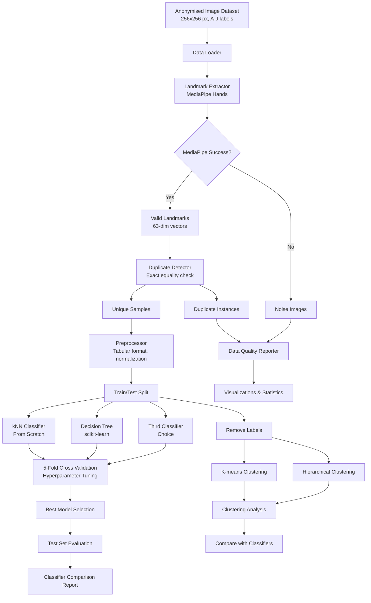

# Design Document: ASL Hand Pose Recognition System

## Overview

This system implements an ASL (American Sign Language) hand pose recognition pipeline for letters A-J. It processes 256x256 pixel images of hand gestures, extracts 63-dimensional landmark features using MediaPipe, preprocesses the data to remove noise and duplicates, trains and compares multiple supervised classifiers (including a custom kNN implementation from scratch), performs unsupervised clustering analysis, and generates comprehensive evaluation reports. The architecture follows a modular pipeline design aligned with the CMP_6058A coursework requirements.

## Architecture



## Components and Interfaces

### 1. DataLoader

**Purpose:** Load images from the anonymised dataset directory and associate them with ASL sign labels (A-J).

**Interface:**
```python
class DataLoader:
    def __init__(self, dataset_path: str)
    def load_dataset(self) -> Tuple[List[np.ndarray], List[str], List[str], Dict[str, int]]
        """
        Returns:
            - images: List of loaded 256x256 image arrays
            - labels: List of corresponding ASL sign labels (A-J)
            - instance_ids: List of anonymised instance identifiers
            - class_counts: Dictionary mapping ASL signs to image counts
        """
    def get_class_names(self) -> List[str]  # Returns ['A', 'B', ..., 'J']
    def get_total_count(self) -> int
    def parse_filename(self, filename: str) -> Tuple[str, str, str]
        """Parse {id}_{sign}_{num}.jpg format"""
```

### 2. LandmarkExtractor

**Purpose:** Extract 21 hand landmarks from images using mediapipe.solutions.hands module.

**Interface:**
```python
class LandmarkExtractor:
    def __init__(self, static_image_mode: bool = True, max_num_hands: int = 1)
    def extract(self, image: np.ndarray) -> Optional[np.ndarray]
        """
        Returns:
            - 63-dimensional feature vector (21 landmarks × 3 coords) if successful
              Ordered: wrist first, then thumb, index, middle, ring, pinky
            - None if MediaPipe fails to detect a hand
        """
    def extract_batch(self, images: List[np.ndarray], labels: List[str], 
                      instance_ids: List[str]) -> Tuple[np.ndarray, List[str], List[str], List[int]]
        """
        Returns:
            - features: Array of valid landmark vectors
            - valid_labels: Labels for successfully extracted images
            - valid_ids: Instance IDs for successfully extracted images
            - failed_indices: Indices of images where extraction failed
        """
```

### 3. NoiseFilter

**Purpose:** Remove images where MediaPipe failed to extract landmarks.

**Interface:**
```python
class NoiseFilter:
    def __init__(self)
    def filter(self, features: np.ndarray, labels: List[str], instance_ids: List[str],
               failed_indices: List[int], original_labels: List[str]) -> Tuple[np.ndarray, List[str], List[str], Dict[str, int]]
        """
        Returns:
            - clean_features: Features with noise removed
            - clean_labels: Labels with noise removed
            - clean_ids: Instance IDs with noise removed
            - noise_counts: Count of removed images per ASL sign class
        """
    def get_noise_report(self) -> Dict[str, Any]
```

### 4. DuplicateDetector

**Purpose:** Identify and remove instances with identical landmark vectors (exact numerical equality).

**Interface:**
```python
class DuplicateDetector:
    def __init__(self)
    def detect_and_remove(self, features: np.ndarray, labels: List[str], 
                          instance_ids: List[str]) -> Tuple[np.ndarray, List[str], List[str], int, Dict[str, int]]
        """
        Returns:
            - unique_features: Features with duplicates removed
            - unique_labels: Labels with duplicates removed
            - unique_ids: Instance IDs with duplicates removed
            - total_duplicates: Total count of removed duplicates
            - duplicate_counts: Count of duplicates per ASL sign class
        """
    def find_duplicates(self, features: np.ndarray) -> List[Set[int]]
        """Returns groups of indices that have identical feature vectors"""
```

### 5. Preprocessor

**Purpose:** Organize data in tabular format, normalize features, encode labels, and create train/test splits.

**Interface:**
```python
class Preprocessor:
    def __init__(self, test_size: float = 0.2, random_state: int = 42)
    def create_dataframe(self, features: np.ndarray, labels: List[str], 
                         instance_ids: List[str]) -> pd.DataFrame
        """Create tabular format with instance-id, 63 features, and label columns"""
    def normalize(self, features: np.ndarray) -> np.ndarray
        """Normalize features (optional, based on classifier needs)"""
    def split(self, features: np.ndarray, labels: np.ndarray) -> Tuple[np.ndarray, np.ndarray, np.ndarray, np.ndarray]
        """Returns X_train, X_test, y_train, y_test"""
    def encode_labels(self, labels: List[str]) -> Tuple[np.ndarray, Dict[str, int]]
        """Convert A-J labels to integer encoding 0-9"""
    def save_to_file(self, df: pd.DataFrame, filepath: str)
```

### 6. KNNClassifierFromScratch

**Purpose:** Custom kNN implementation using only Python standard libraries (no NumPy/scikit-learn for core algorithm).

**Interface:**
```python
class KNNClassifierFromScratch:
    """
    kNN classifier implemented from scratch using only Python standard built-in libraries.
    No NumPy, scikit-learn, or external ML libraries for the core algorithm.
    """
    def __init__(self, k: int = 3)
    def fit(self, X_train: List[List[float]], y_train: List[int]) -> None
        """Store training data"""
    def predict(self, X_test: List[List[float]]) -> List[int]
        """Predict classes for test instances"""
    def _euclidean_distance(self, point1: List[float], point2: List[float]) -> float
        """Compute Euclidean distance using only math module"""
    def _get_neighbors(self, test_instance: List[float]) -> List[Tuple[float, int]]
        """Find k nearest neighbors"""
    def _majority_vote(self, neighbors: List[Tuple[float, int]]) -> int
        """Determine class by majority voting"""
    def score(self, X_test: List[List[float]], y_test: List[int]) -> float
        """Compute accuracy"""
```

### 7. DecisionTreeClassifier (Wrapper)

**Purpose:** Wrapper around scikit-learn DecisionTreeClassifier with hyperparameter tuning support.

**Interface:**
```python
class DecisionTreeWrapper:
    def __init__(self, max_depth: int = None, min_samples_split: int = 2)
    def fit(self, X_train: np.ndarray, y_train: np.ndarray) -> None
    def predict(self, X_test: np.ndarray) -> np.ndarray
    def score(self, X_test: np.ndarray, y_test: np.ndarray) -> float
    def get_params(self) -> Dict[str, Any]
    def set_params(self, **params) -> None
```

### 8. ThirdClassifier (e.g., RandomForest or SVM)

**Purpose:** Third classifier for comparison (developer's choice).

**Interface:**
```python
class ThirdClassifierWrapper:
    def __init__(self, **hyperparameters)
    def fit(self, X_train: np.ndarray, y_train: np.ndarray) -> None
    def predict(self, X_test: np.ndarray) -> np.ndarray
    def score(self, X_test: np.ndarray, y_test: np.ndarray) -> float
    def get_params(self) -> Dict[str, Any]
    def set_params(self, **params) -> None
```

### 9. CrossValidator

**Purpose:** Perform 5-fold cross validation for hyperparameter tuning.

**Interface:**
```python
class CrossValidator:
    def __init__(self, n_folds: int = 5)
    def cross_validate(self, classifier, X: np.ndarray, y: np.ndarray, 
                       param_grid: Dict[str, List]) -> Dict[str, Any]
        """
        Returns:
            - best_params: Best hyperparameter combination
            - best_score: Best cross-validation score
            - all_results: Results for all parameter combinations
        """
    def create_folds(self, X: np.ndarray, y: np.ndarray) -> List[Tuple[np.ndarray, np.ndarray]]
```

### 10. Evaluator

**Purpose:** Compute and report model performance metrics, compare classifiers.

**Interface:**
```python
class Evaluator:
    def __init__(self, class_names: List[str])  # ['A', 'B', ..., 'J']
    def evaluate(self, y_true: np.ndarray, y_pred: np.ndarray) -> Dict[str, Any]
        """
        Returns:
            - accuracy: Overall accuracy
            - sensitivity: Per-class sensitivity (recall)
            - confusion_matrix: 10x10 matrix for A-J classes
            - per_class_metrics: Dict with precision, recall, f1 per class
        """
    def compare_classifiers(self, results: Dict[str, Dict]) -> pd.DataFrame
        """Compare multiple classifiers' performance"""
    def generate_report(self, metrics: Dict[str, Any]) -> str
    def plot_confusion_matrix(self, cm: np.ndarray, title: str)
    def plot_hyperparameter_performance(self, cv_results: Dict)
```

### 11. ClusteringModule

**Purpose:** Apply K-means and hierarchical clustering, compare with classification results.

**Interface:**
```python
class ClusteringModule:
    def __init__(self, n_clusters: int = 10)  # 10 for A-J
    def kmeans_cluster(self, features: np.ndarray) -> np.ndarray
        """Returns cluster assignments"""
    def hierarchical_cluster(self, features: np.ndarray, linkage: str = 'ward') -> np.ndarray
        """Returns cluster assignments"""
    def analyze_clusters(self, cluster_labels: np.ndarray, true_labels: np.ndarray) -> Dict[str, Any]
        """Analyze cluster quality and correspondence to true labels"""
    def compare_with_classifier(self, cluster_labels: np.ndarray, 
                                 classifier_predictions: np.ndarray,
                                 true_labels: np.ndarray) -> Dict[str, Any]
        """Compare clustering output with classifier predictions and true labels"""
```

### 12. DataQualityReporter

**Purpose:** Generate comprehensive reports on data quality and preprocessing.

**Interface:**
```python
class DataQualityReporter:
    def __init__(self)
    def generate_report(self, 
                       original_counts: Dict[str, int],
                       noise_counts: Dict[str, int],
                       duplicate_counts: Dict[str, int],
                       final_counts: Dict[str, int],
                       train_test_split: Dict[str, int]) -> Dict[str, Any]
    def visualize_distribution(self, before: Dict[str, int], after: Dict[str, int], title: str)
    def create_summary_table(self) -> pd.DataFrame
```

## Data Models

### LandmarkVector
```python
@dataclass
class LandmarkVector:
    features: List[float]  # Length 63: 21 landmarks × 3 coordinates
    label: str             # ASL sign (A-J)
    instance_id: str       # Anonymised identifier
```

### DatasetStatistics
```python
@dataclass
class DatasetStatistics:
    total_images: int
    images_per_class: Dict[str, int]  # {'A': n, 'B': n, ..., 'J': n}
    noise_removed: int
    noise_per_class: Dict[str, int]
    duplicates_removed: int
    duplicates_per_class: Dict[str, int]
    final_dataset_size: int
    train_size: int
    test_size: int
```

### ClassifierResults
```python
@dataclass
class ClassifierResults:
    classifier_name: str
    best_params: Dict[str, Any]
    cv_scores: List[float]
    train_accuracy: float
    test_accuracy: float
    confusion_matrix: np.ndarray
    sensitivity_per_class: Dict[str, float]
```

### ClusteringResults
```python
@dataclass
class ClusteringResults:
    method: str  # 'kmeans' or 'hierarchical'
    cluster_labels: np.ndarray
    silhouette_score: float
    match_with_true_labels: float
    match_with_classifier: float
```


## Correctness Properties

*A property is a characteristic or behavior that should hold true across all valid executions of a system—essentially, a formal statement about what the system should do. Properties serve as the bridge between human-readable specifications and machine-verifiable correctness guarantees.*

### Property 1: Data Loading Preserves Image-Label Associations

*For any* dataset directory where images follow the naming convention {id}_{sign}_{num}.jpg, loading the dataset SHALL produce a list of images and labels where each image's label matches the ASL sign extracted from its filename.

**Validates: Requirements 1.1, 1.4, 1.5**

### Property 2: Landmark Extraction Produces Correct Dimensions

*For any* image where MediaPipe successfully detects a hand, the extracted feature vector SHALL have exactly 63 dimensions (21 landmarks × 3 coordinates).

**Validates: Requirements 2.2, 2.3**

### Property 3: Noise Filtering Completeness

*For any* set of images processed through landmark extraction, the noise filter SHALL remove exactly those images where extraction failed, and retain all images where extraction succeeded.

**Validates: Requirements 3.1, 3.3**

### Property 4: Duplicate Detection Invariant

*For any* dataset after duplicate removal, no two samples SHALL have identical feature vectors (exact numerical equality of all 63 coordinates).

**Validates: Requirements 4.2, 4.5**

### Property 5: kNN Distance Calculation Correctness

*For any* two feature vectors, the custom kNN implementation SHALL compute the Euclidean distance correctly: sqrt(sum((a[i] - b[i])^2 for all i)).

**Validates: Requirements 6.2, 6.4**

### Property 6: kNN Majority Voting Correctness

*For any* set of k neighbors, the kNN classifier SHALL return the class that appears most frequently among those neighbors.

**Validates: Requirements 6.5**

### Property 7: Cross Validation Fold Completeness

*For any* 5-fold cross validation run, each data point SHALL appear in exactly one test fold and in exactly four training folds.

**Validates: Requirements 9.1**

### Property 8: Train/Test Split Ratio Preservation

*For any* dataset split operation with a specified test ratio, the actual ratio of test samples to total samples SHALL be within an acceptable tolerance of the specified ratio.

**Validates: Requirements 5.4**

### Property 9: Classifier Output Validity

*For any* trained classifier (kNN, Decision Tree, or third classifier), predictions SHALL be valid class indices within the range 0-9 (corresponding to A-J).

**Validates: Requirements 6.5, 7.4, 8.5**

### Property 10: Confusion Matrix Consistency

*For any* set of true labels and predictions, the confusion matrix diagonal sum SHALL equal the number of correct predictions, and the total sum SHALL equal the number of samples.

**Validates: Requirements 9.7**

### Property 11: Clustering Output Validity

*For any* clustering run with k=10 clusters, all cluster assignments SHALL be integers in the range 0-9.

**Validates: Requirements 10.2, 10.3**

### Property 12: Reporting Count Consistency

*For any* preprocessing run, the sum of (final dataset size + noise removed + duplicates removed) SHALL equal the original dataset size.

**Validates: Requirements 11.1, 11.2, 11.3, 11.4**

## Error Handling

### Landmark Extraction Failures
- **Cause:** MediaPipe cannot detect a hand (partial cropping, wrong orientation, occlusions, non-hand image)
- **Handling:** Return None, flag image as noise, continue processing remaining images
- **Logging:** Record failed image path, instance ID, and class for quality reporting

### Duplicate Detection Edge Cases
- **Floating Point Comparison:** Use exact equality for landmark vectors (as per coursework requirements)
- **Empty Dataset:** If all images are noise or duplicates, raise informative error

### kNN Implementation Edge Cases
- **Tie Breaking:** When multiple classes have equal votes, use the class of the nearest neighbor
- **k > Training Size:** Raise error if k exceeds number of training samples
- **Empty Neighbors:** Handle edge case where no valid neighbors found

### Cross Validation Edge Cases
- **Insufficient Samples:** Require minimum samples per class for stratified folds
- **Class Imbalance:** Log warning if class distribution is highly skewed

### Clustering Edge Cases
- **Convergence:** Set maximum iterations for K-means
- **Empty Clusters:** Handle cases where clusters become empty during K-means

## Testing Strategy

### Unit Tests
Unit tests verify specific examples and edge cases:
- Test DataLoader with mock directory structure and filename parsing
- Test LandmarkExtractor with known good/bad images
- Test DuplicateDetector with synthetic duplicate vectors
- Test kNN distance calculation with known values
- Test kNN majority voting with tie-breaking scenarios
- Test CrossValidator fold creation
- Test Evaluator metrics with known true/predicted labels

### Property-Based Tests
Property-based tests verify universal properties across many generated inputs using Hypothesis:

**Configuration:** Minimum 100 iterations per property test

Each property test must be tagged with:
- **Feature: hand-gesture-recognition, Property {number}: {property_text}**

Property tests to implement:
1. **Data loading round-trip:** Load → extract labels → verify all labels in A-J
2. **Landmark dimension invariant:** For all valid extractions, len(features) == 63
3. **Noise filter completeness:** removed ∪ retained == original
4. **Duplicate uniqueness invariant:** After dedup, all vectors are unique
5. **kNN distance symmetry:** distance(a, b) == distance(b, a)
6. **kNN distance non-negativity:** distance(a, b) >= 0
7. **Cross validation coverage:** Each sample in exactly one test fold
8. **Split ratio accuracy:** |actual_ratio - target_ratio| < tolerance
9. **Classifier output validity:** All predictions in range [0, 9]
10. **Confusion matrix sum:** sum(cm) == len(predictions)
11. **Clustering output range:** All assignments in [0, k-1]
12. **Count conservation:** original == final + noise + duplicates

### Integration Tests
- End-to-end pipeline test with sample dataset
- kNN vs scikit-learn kNN comparison (for validation)
- Full classifier comparison workflow
- Clustering analysis with known cluster structure
